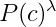

# Noisy-Channel-Spell-Checker
A tool for correcting misspellings in textual input using the Noisy Channel Model.

## Usage
- [ ] Clone the repository 
- [ ] Install SRILM
- [ ] set variable **SRILM_PATH** in ``spell-checker.py`` to your SRILM binary folder
   (e.g. ``/user/srilm/bin/i686-m64``)
- [ ] Run ``python3 spell-checker [args]``

We recommend to use a Linux operating system. On Windows systems it is also possible by porting it using Cygwin.

## Command Line Parameters
The tool can be executed by calling ``spell-checker.py``. It provides a variety of parameters for controlling different aspects.

| **Argument**        |    **Value**        | **Description**  |
| :-------------: |:-------------:|:-----:|
| **`-c`** or **`--correct`**       | file \| directory \| Standard Input | Text that is supposed to be corrected by the spell checker. You can enter one or more files, multiple directories or direct input. Directories are recursively traversed  |
| **`-o`** or **`--output`**       | file \| directory  | Determine where to store the corrected files (per default: location of input data) |
| **`-ow`** or **`--overwrite`**       |  | If set, all the selected documents are overwritten by its correction. |
|      | |  |
| **`-lm`** or **`--languagemodel`**       | lm.arpa | TODO: (kombi mit arpa -> datei lesen)Filename to determine where to store the trained, arpa-formated language model. |
| **`-tr`** or **`--train`**       | file \| directory | Training files to train a language model. You can enter file(s) or entire folder(s). |
| **`-ocr`**       |  | Use tool to post-process noisy OCR texts. **Attention:** You can either use the -ocr or the -typo option.  |
| **`-typo`**       |  | Use tool to correct texts containing typos. |
|      | |  |
| **`--lmweight`**  | float number |  numeric value $$w$$ that weights the language model 
 |
| **`--order`**        | Integer | Order of generated language model. Default: 2-gram |
| **`--error_model_smooth`**| float number | Pseudocount for laplace smoothing of the error model probabilities. |
| **`-sw`** or **`--stopwords`**       | stopwords.file \| direct input | List of stopwords being ignored during correction |
|      | |  |
| **`-v`** or **`--version`**       |  | Prints version of the Noisy Channel Spell Checker. |
| **`-q`** or **`--quiet`**       | | Suppress printouts. |
| **`-vb`** or **`--verbose`**       |  |  Print verbose. |
|      | |  |
| **`-te`** or **--test`**      | | Evaluates the spell checker on the sample documents from the Royal Society Corpus |
| **`--royal`**      | | Correct the entire Royal Society Corpus |
| **`-ppl`** or **`--perplexity`**       | textfile, languagemodel.arpa \| Standard Input | Computes the Perplexity measure for given file and language model |
| **`--num_cores`** or **`-cores`**       | Integer | Number of cores that can be used for computations, default: N - 1  |


## Typical calls 

#### Train a Language Model from scratch
The n-gram **order** has to be specified a priori. The **train** parameter gets all 
It supports a sequence of files or folders. Beside ordinary text files the parser supports well-structured xml-files and xml.tagged-files are verticalized xml-files annotated by the TreeTagger    
 
```ps
python spell-checker.py --order 2 --train data/corporaTagged/ -lm LM2.arpa
```

The Spell Checker also
```ps
python spell-checker.py --order 2 --correct file.txt directory/ -lm data/LM2.arpa 
```

```ps
python spell-checker.py -lm data/LM2.arpa --test --order 2 --num_cores 2
```


```ps
python spell-checker.py -lm data/LM2.arpa --royal --order 2 --num_cores 2```
```

##  References

Tree Tagger 1,2